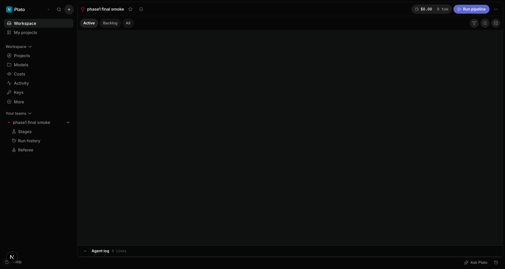
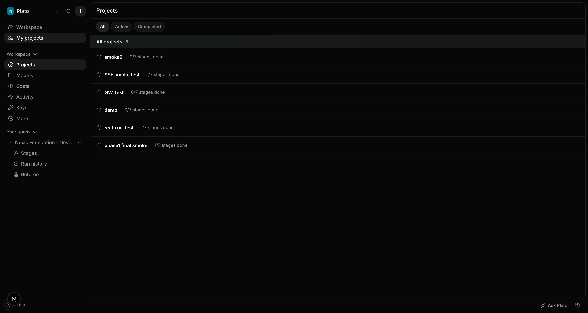
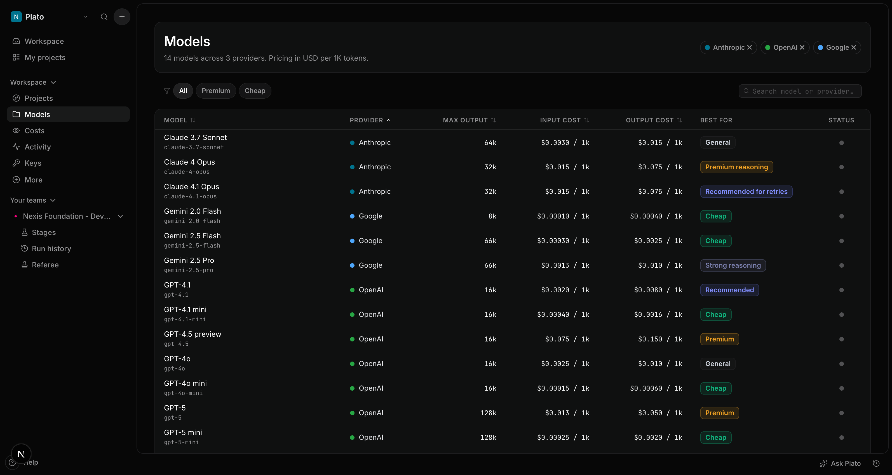
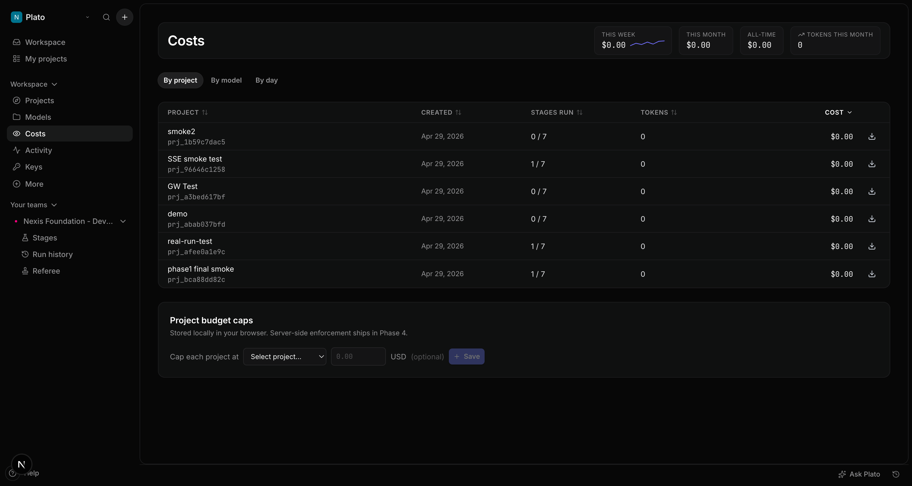
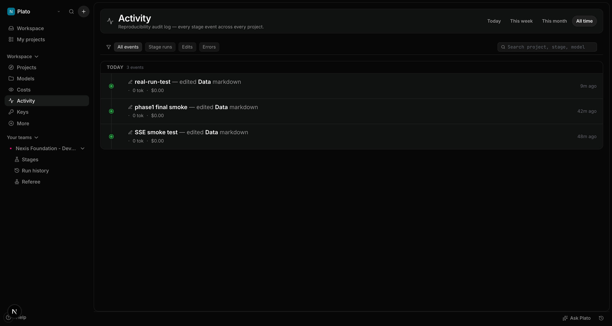
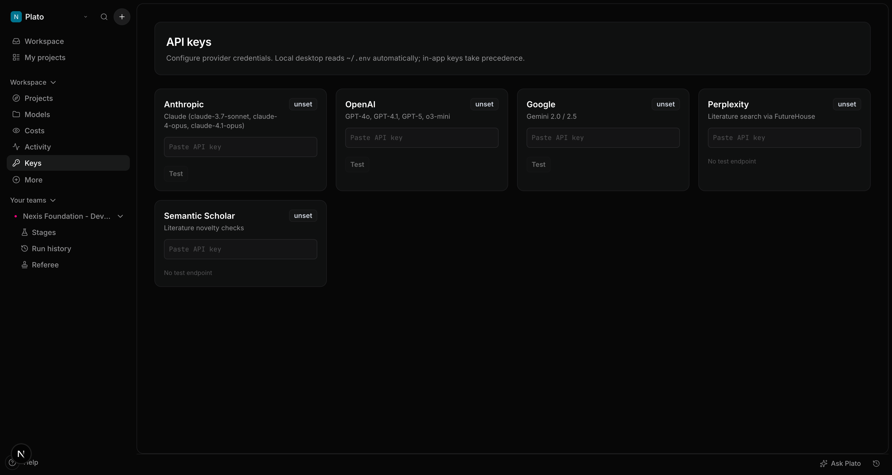

# Plato Dashboard

> A Linear-themed web dashboard for [Plato](https://github.com/AstroPilot-AI/Plato), the multi-agent scientific research assistant. Replaces the legacy Streamlit `PlatoApp` with a real-time, IDE-style workspace.

This repo lives at `dashboard/` inside the Plato monorepo. It is published as a separate Python package (`plato-dashboard`) and JavaScript app, but they're developed side-by-side here.

## What this is

A two-process app:

- **`backend/`** — FastAPI gateway that wraps Plato's Python class, runs each long-running stage (`get_idea`, `get_method`, `get_results`, `get_paper`, `referee`) in a subprocess worker, and streams agent reasoning + token usage to the frontend over Server-Sent Events.
- **`frontend/`** — Next.js 15 + React 19 + Tailwind v4, themed with [Linear's `DESIGN.md` tokens](https://github.com/Eldergenix/SUPER-DESIGN/blob/main/super-design-md/linear.app/DESIGN.md) via the [SUPER-DESIGN skill](https://github.com/Eldergenix/SUPER-DESIGN). Five core primitives (`StageCard`, `AgentLogStream`, `PlotGrid`, `PaperPreview`, `CitationChip`) plus power components (`ModelPicker`, `RunMonitor`).

Two first-class deployment shapes share one codebase:

| Shape | Mode | Auth | Use |
|---|---|---|---|
| Local desktop (default) | `PLATO_DEMO_MODE=disabled` | none | scientists running on their laptop |
| Public demo | `PLATO_DEMO_MODE=enabled` | session cookie | HuggingFace Spaces / Vercel showcase |
| Self-hosted lab (stretch) | `PLATO_AUTH=enabled` | bearer cookie | small team via Docker Compose |

In demo mode, code-executing stages (`results`, `cmbagent`, paper generation with citations) are locked, the session enforces a hard $-budget cap, and projects are auto-cleaned after 30 min idle. See `backend/src/plato_dashboard/api/capabilities.py`.

## Screenshots

> All screenshots captured at 1594×900 against the live dev backend.

| Workspace (`/`) | Projects (`/projects`) |
|---|---|
|  |  |

| Models (`/models`) | Costs (`/costs`) |
|---|---|
|  |  |

| Activity (`/activity`) | Keys (`/keys`) |
|---|---|
|  |  |

### Stage detail views

- [Workspace stage list with all sections expanded](scripts/dashboard-phase2-all.png)
- [Stage detail panel (Idea stage)](scripts/dashboard-phase2-stage-detail.png)

## Routes

| Path | Page | What it does |
|---|---|---|
| `/` | Workspace | Linear-style stage list with grouped sections; click a stage to open detail |
| `/projects` | Projects | Cross-project list with filter pills + create modal |
| `/models` | Models | 14-model capability/cost matrix with sortable columns |
| `/costs` | Costs | Cross-project token + dollar ledger with budget caps |
| `/activity` | Activity | Reverse-chronological audit feed |
| `/keys` | Keys | Per-provider API key management with test endpoint |

## Backend API

All paths under `/api/v1`.

| Method | Path | Purpose |
|---|---|---|
| GET | `/health` | Liveness check |
| GET | `/capabilities` | Allowed stages, budget, demo flag |
| GET | `/projects` | List all projects |
| POST | `/projects` | Create a new project |
| GET | `/projects/{pid}` | Fetch one project's metadata |
| DELETE | `/projects/{pid}` | Delete a project |
| GET | `/projects/{pid}/state/{stage}` | Read a stage's markdown content |
| PUT | `/projects/{pid}/state/{stage}` | Write a stage's markdown content (auto-snapshot) |
| POST | `/projects/{pid}/stages/{stage}/run` | Start a stage run in a subprocess worker |
| GET | `/projects/{pid}/runs/{run_id}` | Get a run's status |
| POST | `/projects/{pid}/runs/{run_id}/cancel` | Cancel a running stage |
| GET | `/projects/{pid}/runs/{run_id}/events` | Subscribe to SSE event stream for a run |
| GET | `/projects/{pid}/runs` | List all runs for a project |
| GET | `/projects/{pid}/plots` | List generated plot files |
| GET | `/projects/{pid}/files/{relpath}` | Stream a file from the project dir |
| GET | `/keys/status` | Which providers have keys configured |
| PUT | `/keys` | Save/update a provider API key |
| POST | `/keys/test/{provider}` | Test a provider key against its API |

## Quick start (development)

```bash
# Terminal 1 — backend
cd backend
python3.13 -m venv .venv && source .venv/bin/activate
pip install -e .

# Install Plato itself into the same venv so the worker subprocess
# can import it. This pulls cmbagent + langgraph + ~200 transitive deps.
pip install -e ../..

# Pin mistralai < 2.0 — cmbagent.ocr imports v1-style DocumentURLChunk
# that v2 removed (otherwise `from plato.plato import Plato` will fail).
pip install "mistralai<2.0"

plato-dashboard-api          # → http://127.0.0.1:7878

# Terminal 2 — frontend
cd frontend
npm install
npm run dev                  # → http://localhost:3000 (or 3001 if 3000 is busy)
```

Open the printed frontend URL. The frontend auto-detects the backend at `http://127.0.0.1:7878`; if it's down, the UI falls back to a rich sample dataset so the design is demoable as a static page.

### Demo mode

```bash
PLATO_DEMO_MODE=enabled plato-dashboard-api
```

The dashboard renders a "Demo mode active" banner across the top, locks `results` / `paper` runs with a friendly 403, and applies the $-cap.

### From the parent Plato repo

After installing both packages (`pip install -e plato/ -e dashboard/backend/`), you get the unified CLI:

```bash
plato dashboard              # launch
plato dashboard --demo       # demo mode
plato dashboard --port 8080  # different port
plato dashboard --no-browser # don't auto-open
```

This lives at `plato/cli.py` and runs alongside the legacy `plato run` (Streamlit) command.

## Project layout

```
dashboard/
├── DESIGN.md                  # Linear design tokens (verbatim from SUPER-DESIGN)
├── backend/
│   ├── pyproject.toml         # FastAPI + arq + watchfiles + pydantic
│   └── src/plato_dashboard/
│       ├── api/
│       │   ├── server.py      # FastAPI routes: projects, stages, runs, files, keys
│       │   └── capabilities.py # PLATO_DEMO_MODE / PLATO_AUTH enforcement
│       ├── domain/models.py   # Pydantic shapes shared with the frontend
│       ├── storage/
│       │   ├── project_store.py   # mirrors Plato's project_dir/ layout exactly
│       │   └── key_store.py       # encrypted ~/.plato/keys.json (mode 0600)
│       ├── events/bus.py      # in-memory pub/sub (Redis swap-in for prod)
│       ├── worker/
│       │   └── run_manager.py # subprocess Plato runner + cancellation
│       └── settings.py        # env-driven config
└── frontend/
    ├── src/app/
    │   ├── globals.css        # Tailwind v4 @theme with Linear tokens
    │   ├── layout.tsx         # Inter Variable + JetBrains Mono
    │   └── page.tsx           # Dashboard shell
    ├── src/components/
    │   ├── shell/             # Sidebar, TopBar, CommandPalette, AgentLogStream
    │   ├── stages/            # StageStrip, DataStage, IdeaStage, ResultsStage, EmptyStage
    │   └── ui/                # Button, Pill, StatusDot
    └── src/lib/
        ├── api.ts             # backend client + SSE wrapper
        ├── use-project.ts     # React hook: live project + log + run start/cancel
        ├── models.ts          # 14-model registry mirroring plato/llm.py
        └── types.ts
```

## On-disk project layout (mirrors Plato exactly)

```
~/.plato/
├── projects/<uuid>/
│   ├── meta.json                    # dashboard-only: stages, journal, run state
│   ├── input_files/                 # ← the same dir Plato's Python class writes to
│   │   ├── data_description.md
│   │   ├── idea.md
│   │   ├── methods.md
│   │   ├── results.md
│   │   ├── literature.md
│   │   ├── referee.md
│   │   ├── plots/
│   │   └── .history/<stage>_<ts>.md
│   ├── paper/                       # main.pdf, main.tex, references.bib
│   ├── idea_generation_output/      # cmbagent logs (when run via cmbagent mode)
│   ├── method_generation_output/
│   ├── experiment_generation_output/
│   └── runs/<run_id>/               # per-run scratch + status.json heartbeat
└── keys.json                        # encrypted, mode 0600
```

Because the layout matches Plato's existing convention, the same `project_dir` works whether driven by the dashboard or the Python class — no migration required.

## Architecture cheat-sheet

```
[Browser] ── HTTPS ──▶ [Next.js (RSC + route handlers)]
                              │
                              └── REST / SSE / WS ──▶ [FastAPI]
                                                       │
                                                       ├── enqueue ──▶ [Redis]
                                                       │                  │
                                                       │                  └──▶ [arq worker (multiprocessing.Process)]
                                                       │                              │
                                                       │                              └──▶ Plato.get_idea / get_method / ...
                                                       │
                                                       └── reads ──▶ [project FS: ~/.plato/projects/<id>/]
```

Why subprocesses, not threads: cmbagent holds its own subprocess for code execution, and `asyncio.to_thread` cannot kill grandchildren. Killing the process group on cancel is the only reliable path. Plato's API stays sync and untouched; the dashboard adapts around it.

## Status

### Phase 1 — Foundation ✅

- ✅ Repo skeleton, design tokens (Linear `DESIGN.md` → Tailwind v4 `@theme`)
- ✅ App shell (sidebar, topbar, stage strip, command palette `Cmd/Ctrl+K`, log drawer)
- ✅ All 7 stage views (Data + Idea + Results fully populated; Literature/Method/Paper/Referee as branded empty states)
- ✅ Project CRUD on the FastAPI side
- ✅ Capabilities middleware (PLATO_DEMO_MODE blocks results/paper stages with 403 + helpful error)
- ✅ Stage IO (read/write markdown to canonical filenames; auto-snapshot to `.history/`)
- ✅ Run lifecycle + SSE event stream
- ✅ Frontend wired to live backend with offline fallback (sample data)
- ✅ `plato dashboard` CLI hook

### Phase 2 — Real pipeline ✅

- ✅ Real subprocess executor with cancellation probe + cmbagent code-execution
- ✅ watchfiles log-tail bridge for cmbagent `*_generation_output/` log streams
- ✅ LangGraph `astream_events` typed-event bridge for fast-mode stages
- ✅ Token aggregation tracker reading from `LLM_calls.txt`
- ✅ Linear-style UI refactor (grouped stage list, detail panel, breadcrumbs)
- ✅ All shell + stage components built (StageStrip, AgentLogStream, RunMonitor)

### Phase 3 — Multi-page dashboard ✅

- ✅ 6 routes wired (`/`, `/projects`, `/models`, `/costs`, `/activity`, `/keys`)
- ✅ `CostMeterPanel` with live token + dollar tracking against budget cap
- ✅ `ApprovalCheckpoints` for stage gating in demo mode
- ✅ `Activity` timeline reading from event bus
- ✅ Docker Compose + HuggingFace Spaces deploy targets
- ✅ 32 pytest tests passing on the backend
- ✅ 5 Playwright specs covering smoke, navigation, palette, stage flow, keys

### Phase 4 — Loose ends

- [ ] Real LLM run with API keys (requires user-side credentials)
- [ ] Public Vercel / HuggingFace Spaces deployment
- [ ] Multi-tenant SaaS (sandboxing for cmbagent code execution)

## Test plan

After installation, verify:

- [ ] `curl -s http://127.0.0.1:7878/api/v1/health` returns `{"ok":true,...}`
- [ ] All 6 routes (`/`, `/projects`, `/models`, `/costs`, `/activity`, `/keys`) return HTTP 200
- [ ] `cd dashboard/backend && pytest tests/` — all 32 tests pass
- [ ] `cd dashboard/frontend && npx tsc --noEmit` — no errors
- [ ] `cd dashboard/frontend && npx playwright test smoke.spec.ts` — passes
- [ ] Cmd+K opens the command palette
- [ ] Clicking a row in `/projects` opens the workspace
- [ ] Clicking a stage in the workspace's stage list opens the detail view

## Smoke test

```bash
# In one shell
cd backend && source .venv/bin/activate && plato-dashboard-api &
sleep 2
# In another shell
curl -s http://127.0.0.1:7878/api/v1/health
curl -sX POST http://127.0.0.1:7878/api/v1/projects \
  -H "Content-Type: application/json" -d '{"name":"smoke"}'
```

You should see `{"ok":true,"demo_mode":false}` and a fresh project. Then visit the frontend at `http://localhost:3000`.

## License

GPLv3, matching the parent Plato project.
