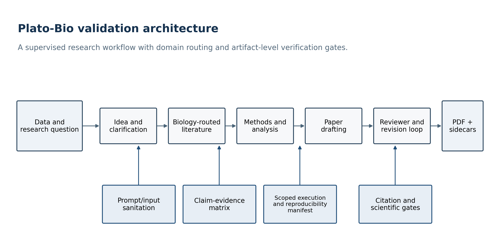
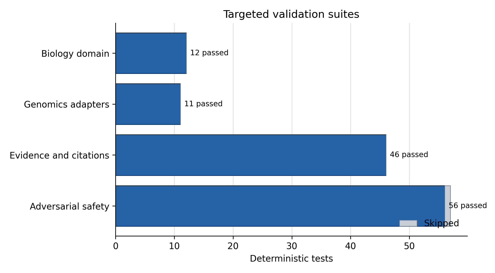
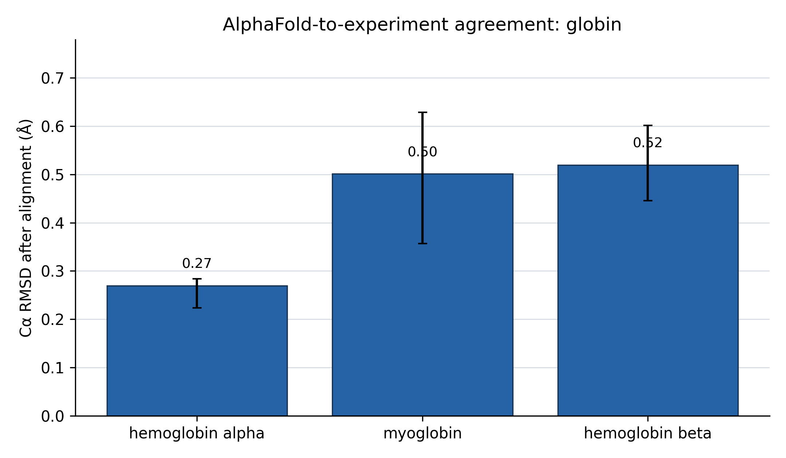
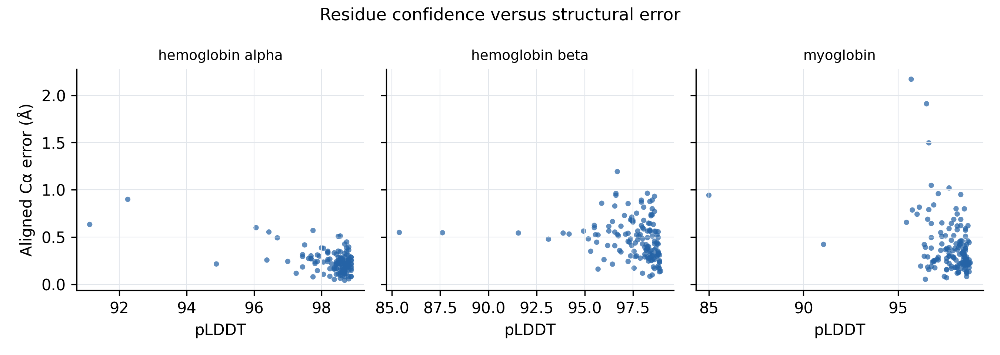

# Plato-Bio: a verification-first multi-agent research workflow with a reproducible structural-biology case study

**Stefan Creadore¹**

¹ Eldergenix, United States

**Correspondence:** via the repository issue tracker at https://github.com/Eldergenix/Plato-Scientific-Research-Autonomous-Agent

**Article category:** New Results

**bioRxiv subject area:** Bioinformatics

**Keywords:** scientific agents; bioinformatics; reproducibility; citation validation; evidence provenance; AlphaFold; structural biology

## Abstract

Large-language-model agents can connect literature retrieval, analysis code, and manuscript drafting, but a fluent output is not evidence that the underlying workflow is scientifically valid. We present Plato-Bio, a biology-routed, verification-first extension of the open Plato/Denario research-agent architecture. The system uses explicit state-machine orchestration for idea development, literature retrieval, method generation, computation, paper drafting, citation checking, claim-to-evidence linking, consistency checks, and bounded self-critique. Fork-specific controls include biology-aware retrieval, a typed genomics adapter registry, mixed claim/evidence sidecars, run manifests, scoped file writes, prompt-injection screening, and publication gates. We audited the implementation and repaired three measurement defects: biology tasks losing their domain at the default evaluation factory, declared method signals not being scored, and evidence sidecars omitting the drafted-claim denominator. After repair, the deterministic Python suite completed without failures; targeted biology, genomics, evidence/citation, and adversarial-safety suites also completed without failures. These counts verify software contracts, not scientific efficacy.

To demonstrate a fully reproducible biological computation independent of paid model providers, we compared AlphaFold Database models with experimental structures for human hemoglobin α, hemoglobin β, and myoglobin. Sequence-aware Cα matching followed by Kabsch superposition yielded RMSDs of 0.270, 0.520, and 0.501 Å, respectively. At least 99.3% of matched residues were within 2 Å of the experimental coordinates, and pLDDT showed modest positive rank correlation with lower residue-level error (Spearman ρ=0.242–0.353; all nominal P≤0.0039). The study establishes a transparent validation baseline and a submission artifact, but does not demonstrate autonomous discovery, improved manuscript quality, or independent peer review. Plato-Bio should therefore be used as a supervised research instrument whose claims remain the responsibility of human authors.

## Introduction

Automation has long been used to make parts of scientific inference more explicit and repeatable. The Robot Scientist “Adam,” for example, coupled hypothesis generation, experimental planning, laboratory automation, and interpretation in functional genomics [1]. Recent language-model systems extend automation to literature review, code generation, experiment execution, and scientific writing. The AI Scientist [2], Agent Laboratory [3], and the Denario project [4] demonstrate broad agentic workflows that can generate or assemble research artifacts. These systems are valuable prototypes, but their ability to produce polished prose creates a risk: output quality can be mistaken for evidentiary quality.

This distinction is particularly important in computational biology. Biological analyses frequently depend on versioned reference assemblies, database accessions, coordinate conventions, chain or isoform mapping, statistical assumptions, and data-use conditions. A research agent must therefore preserve not only text but also the relationship between claims, sources, calculations, and executable artifacts. FAIR data principles similarly emphasize findability, accessibility, interoperability, and reuse as properties of scientific objects rather than rhetorical descriptions [5].

Plato is a maintained fork and extension of the open Denario/Plato codebase. The prior Denario preprint describes a broad multi-agent assistant and reports expert assessment of generated papers across several disciplines [4]. The present work is not a duplicate or renamed version of that manuscript. It focuses on fork-specific validation infrastructure, measurement defects discovered during a source-level audit, and a new, compact structural-biology case study whose inputs and outputs are shipped in the repository.

We make four contributions. First, we describe a biology-routed workflow in which literature sources, keyword extraction, execution defaults, and journal choices are represented by an explicit domain profile. Second, we document evidence and safety controls that create inspectable artifacts: citation-validation reports, claim/evidence matrices, scientific-consistency checks, and run manifests. Third, we repair and regression-test three defects that would otherwise distort evaluation measurements. Fourth, we provide a deterministic AlphaFold-to-experiment benchmark with source URLs, SHA-256 hashes, residue-level data, summary statistics, and figures. Our central claim is deliberately narrow: the current repository implements and tests these software contracts and reproduces this case study. We do not infer autonomous scientific validity from test counts or from the case study.

## Methods

### Study design and claim boundary

We conducted a source-level architecture audit, repaired measurement defects whose behavior contradicted documented contracts, ran deterministic validation suites, and executed a preregistered-in-code structural comparison panel. The panel was declared as a constant before results were inspected and contained three UniProt/PDB mappings: P69905 to PDB 1A3N chain A, P68871 to PDB 1A3N chain B, and P02144 to PDB 3RGK chain A. The analysis did not use an LLM, select targets after observing results, or perform a hypothesis search.

Software tests were interpreted as contract verification only. A passing test indicates that an asserted behavior was observed in the test environment; it does not estimate biological accuracy, citation precision in open-ended use, or paper quality. Live provider tests requiring credentials or optional cloud services were reported as skipped rather than converted into successful or zero-valued scientific outcomes.

### System architecture

Plato represents the research process as explicit LangGraph state machines rather than a single monolithic prompt. The public workflow accepts a data description, develops an idea, produces a method, executes an analysis, and drafts a manuscript. The paper graph orders section drafting before citation validation, scientific consistency checks, claim extraction, evidence linking, reviewer-role critiques, aggregation, and a bounded redraft decision. The reviewer roles use the configured drafting model in the current implementation and are therefore self-critique roles, not independent reviewers.

The biology domain profile selects PubMed, Europe PMC, OpenAlex, Crossref, DOAJ, DataCite, OpenCitations, and Semantic Scholar as retrieval sources; MeSH-based keyword extraction; PubMed as the novelty corpus; and a local Jupyter executor by default. Optional genomics adapters prepare typed, permission-gated operations for GenomeKit, ZIPPY, Paragraph, ExpansionHunter Denovo, Gauchian, and Illumina Connected Analytics. Most adapters validate requirements and prepare external commands or requests; their presence does not imply that the external software or licensed data are locally installed.

### Evidence, provenance, and publication controls

Retrieved material is screened and wrapped as external content before entering prompts. The citation node resolves structured references and writes a validation report. A configured publication gate requires references to be present and applies a validation threshold; the threshold is a policy setting, not an observed accuracy estimate. The scientific verifier checks for artifact presence, unsupported quantitative language, provenance language, and validation status. These checks are heuristic consistency controls, not independent re-execution of every analysis.

The claim/evidence stage distinguishes drafted claims from source-derived claims and classifies source relationships as supporting, refuting, neutral, or unclear. The corrected JSONL sidecar stores the drafted Claim rows and EvidenceLink rows in the same documented stream, preserving both the denominator and support links needed to calculate unsupported-claim rate. Run-manifest primitives record workflow, timestamps, domain, repository and project hashes, models, prompts, seeds, sources, token counts, and cost when those values are supplied by the calling path.

### Measurement-validity repairs

Three defects were treated as study-blocking because each could change an evaluation result without changing system behavior.

1. The default evaluation factory constructed every task with Plato’s default astronomy profile. We changed the factory to pass `task.domain`, so the shipped protein task uses the biology profile.
2. Golden tasks declared `expected_method_signals`, but the evaluator did not score them. We added `method_signal_recall`, calculated only from the method artifact, and included it in aggregate summaries.
3. The evidence producer wrote only links while the evaluator and dashboard expected mixed claim/link rows. When no Claim rows were present, unsupported-claim rate defaulted to 0.0. We changed the producer to persist drafted claims before links, including when no source claims are available.

Each repair was covered by a failing regression test before the implementation change and then verified with the relevant targeted suites.

### Deterministic software validation

The repository-local script `preprint/experiments/run_software_validation.py` ran five suites with the checked-in Python environment: biology-domain behavior, genomics adapters, evidence/citation controls, adversarial safety, and the complete Python test tree. It invoked pytest with JUnit XML output, parsed tests/failures/errors/skips, and wrote a JSON report containing the command, commit, platform, Python version, and timing. The targeted suites overlap with the full suite; their counts are presented to show control-specific coverage and must not be summed.

The complete suite includes unit, trajectory, safety, and opt-in integration tests. Skips correspond to missing optional SDKs or credentials for E2B, Modal, PostgreSQL, Hugging Face, and one platform-specific path case. No skipped integration was reported as validated.

### Structural-biology case study

Experimental coordinates were downloaded from the RCSB Protein Data Bank [6]. PDB 1A3N is a 1.8 Å X-ray structure of deoxy human hemoglobin; chains A and B were used for the α and β subunits. PDB 3RGK is a 1.65 Å X-ray structure of the human myoglobin K45R variant; its single sequence mismatch relative to the UniProt target was excluded from coordinate matching. AlphaFold Database models were retrieved through the public prediction API for UniProt P69905, P68871, and P02144 [7]. The retrieval manifest records model URLs, database version, model creation date, global confidence, and SHA-256 hashes for every downloaded file.

PDB files were parsed from `ATOM` records. We retained the first blank/A alternate-location Cα atom for each residue in the declared chain. Three-letter residue names were mapped to one-letter codes. Predicted and experimental sequences were globally aligned with Needleman–Wunsch dynamic programming (match 2, mismatch −1, gap −2); coordinate pairs were retained only when both aligned residues were present and identical.

Predicted Cα coordinates were superposed on experimental coordinates using the Kabsch least-squares rotation [8]. We calculated global Cα RMSD, median residue error, fractions within 2 and 5 Å, mean pLDDT, and Spearman rank correlation between pLDDT and negative residue error. A positive correlation therefore means that greater model confidence is associated with lower structural discrepancy. The Kabsch implementation was regression-tested against a synthetic rigid rotation and translation. The analysis script, raw coordinate files, residue-level CSV, target summary, source hashes, and figures are included with this preprint.

No correction for multiple comparisons was applied to the three correlation tests because the correlations are descriptive secondary endpoints in a small validation case study. Exact nominal P values are reported and no biological discovery claim is based on them. Local distance difference test (lDDT) is a widely used superposition-free structural score [9], but this compact study reports the simpler residue-level aligned Cα error so every calculation remains inspectable in the supplied script.

## Results

### Audit and repaired measurement paths

The audit confirmed that the repository contains explicit idea/method and paper graphs, biology-specific routing, citation and evidence components, execution backends, manifests, and submission-package primitives. It also found that the default evaluation harness stops after idea and method generation; paper scoring therefore falls back to those texts when no paper exists. The autonomous loop adapters score existing artifacts but do not run a declared research pipeline. Paper reviewer roles currently use the drafting client. These findings constrain the interpretation of the present work: architecture and deterministic controls are evaluated; live end-to-end scientific performance and autonomous improvement are not.

After the three measurement repairs, targeted tests confirmed that biology task construction preserved the biology domain, method-signal recall was emitted, and real evidence-node JSONL artifacts contained Claim denominators and support links. The corrected artifact can now yield a nonzero unsupported-claim rate when drafted claims lack support, rather than a false 0.0 caused by an absent denominator.

### Software validation results

The complete Python suite produced no failures or errors. The targeted biology-domain, genomics-adapter, evidence/citation, and adversarial-safety suites also produced no failures or errors. Some full-suite tests were skipped because optional live dependencies, provider credentials, or a platform-specific path condition were unavailable. Figure 2 and Table 1 report exact counts from the machine-readable validation report generated for this revision.

| Suite | Tests | Passed | Skipped | Failures/errors |
|---|---:|---:|---:|---:|
| Biology domain | 12 | 12 | 0 | 0 |
| Genomics adapters | 11 | 11 | 0 | 0 |
| Evidence and citations | 46 | 46 | 0 | 0 |
| Adversarial safety | 57 | 56 | 1 | 0 |
| Full Python suite | 918 | 912 | 6 | 0 |

The targeted suites are subsets of the full suite. These results support the narrower statement that the asserted software behaviors passed in the recorded environment. They do not measure paper correctness, novelty, human usefulness, or the probability that an open-ended agent run will succeed.

### AlphaFold-to-experiment structural agreement

All three targets produced high sequence coverage and sub-ångström Cα RMSD after sequence-aware superposition (Table 2). Hemoglobin α had the lowest RMSD (0.270 Å), followed by myoglobin (0.501 Å) and hemoglobin β (0.520 Å). All matched α and β hemoglobin residues were within 2 Å of their experimental coordinates. For myoglobin, 146 of 147 matched residues (99.3%) were within 2 Å and all were within 5 Å.

<!-- PAGE BREAK -->

| Target | UniProt | PDB chain | Matched residues | Sequence identity | Cα RMSD (Å) | Median error (Å) | Within 2 Å | Mean pLDDT |
|---|---|---|---:|---:|---:|---:|---:|---:|
| Hemoglobin α | P69905 | 1A3N A | 141 | 1.000 | 0.270 | 0.220 | 1.000 | 98.30 |
| Hemoglobin β | P68871 | 1A3N B | 145 | 1.000 | 0.520 | 0.453 | 1.000 | 97.55 |
| Myoglobin K45R comparison | P02144 | 3RGK A | 147 | 0.987 | 0.501 | 0.310 | 0.993 | 97.71 |

Residue-level pLDDT was positively associated with lower aligned coordinate error in each target: hemoglobin α ρ=0.242 (P=0.00388), hemoglobin β ρ=0.353 (P=1.34×10⁻⁵), and myoglobin ρ=0.283 (P=0.000515). The restricted pLDDT range (mean 97.5–98.3) limits calibration inference, and the correlations should be interpreted as descriptive consistency rather than proof that pLDDT is fully calibrated for this family.

### Reproducibility artifacts

The case-study output contains the two experimental PDB files, three AlphaFold models, source and output hashes, a target-level CSV, a 433-row residue-level CSV, and a JSON manifest. Re-running the analysis reconstructs all summary values and Figures 3–4. A second script reconstructs Figures 1 and 2 from the repository architecture and validation JSON. The paper source, editable Word manuscript, and submission PDF are generated from the same controlled source bundle.

## Discussion

This work addresses a practical gap between agent capability claims and inspectable scientific evidence. A multi-agent graph can make workflow stages visible, but visibility alone does not make outputs correct. Plato-Bio’s most useful design property is the separation of artifacts: source records, citation reports, claims, evidence links, analysis outputs, manifests, and manuscript files can be inspected independently. The repaired mixed JSONL contract illustrates why this matters. Without persisted claims, an unsupported-claim metric could report a reassuring zero despite lacking the denominator required to calculate it.

The biology domain profile and genomics registry provide an extensible interface for biological work. Domain routing reduces accidental use of astronomy-specific sources, while typed adapters expose requirements, permissions, coordinate conventions, and expected artifacts before an external genomics command is executed. This is useful safety and reproducibility scaffolding, but it is not a validation of GenomeKit, Paragraph, ExpansionHunter Denovo, Gauchian, ZIPPY, or Illumina Connected Analytics themselves.

The globin study demonstrates the intended evidence pattern. Source identities are fixed, coordinates are archived with hashes, alignment rules are explicit, the rigid-body fit is regression-tested, target- and residue-level results are preserved, and conclusions are proportional to the data. The sub-ångström agreement is consistent with the strong performance reported for AlphaFold and with the purpose of AlphaFold DB [7,10]. It should not be interpreted as a new benchmark of the broader AlphaFold proteome: the panel contains three related, high-confidence globins selected for a compact reproducibility case study, and one experimental structure contains a known point mutation.

The source audit also changes how the agent itself should be described. The current default evaluation is an idea/method benchmark, not an end-to-end paper benchmark. The paper’s reviewer roles are same-model self-critique, not independent review. The autonomous loop infrastructure can keep or discard scored states, but its default adapters do not execute a full research cycle. These limitations are not wording details; they determine what can be concluded from future evaluations. A definitive efficacy study will require frozen biological tasks, versioned datasets, real results and paper generation, multiple stochastic repetitions, baseline/ablation conditions, and blinded domain-expert adjudication.

### Limitations

The biological case study is intentionally small and does not include cryo-electron microscopy density fitting, lDDT, side-chain accuracy, ligand geometry, oligomeric interfaces, or conformational ensembles. PDB 3RGK is a K45R myoglobin mutant, and nonidentical aligned positions were excluded. Correlation tests are descriptive and unadjusted. Raw structures were retrieved from public services whose upstream records may be revised; file hashes freeze the exact analyzed bytes.

The software evaluation is deterministic and largely unit-level. LLM calls, paid retrieval services, Modal, E2B, hosted PostgreSQL, and authenticated Hugging Face paths were not available in the recorded environment. No claim is made that the configured citation threshold equals observed citation accuracy. Prompt-injection screening and scientific-verifier rules are heuristic and do not sandbox generated code or prove factual correctness. Local execution of LLM-generated code should not be used with sensitive data or production credentials without an external sandbox and human review.

Authorship and submission metadata remain human responsibilities. The corresponding author must confirm the author list, affiliations, ORCIDs, contribution statement, funding, conflicts, and consent before deposit. bioRxiv screening does not replace peer review, and this preprint should not be represented as certified scientific evidence.

## Conclusion

Plato-Bio provides a concrete, inspectable foundation for supervised computational-biology workflows: explicit graphs, biology-aware routing, typed genomics adapters, evidence and citation artifacts, consistency gates, and reproducibility records. The present audit and repairs improve the validity of future measurements, while the globin case study demonstrates an end-to-end reproducible computation with public inputs and machine-readable outputs. The current evidence supports software-contract and case-study reproducibility claims only. Establishing agent efficacy will require a larger preregistered biological benchmark, independent human assessment, and live end-to-end runs with complete provenance.

## Data and code availability

Code, manuscript source, experiment scripts, exact input coordinate files, hashes, derived CSV files, figures, and validation JSON are available in the companion repository: https://github.com/Eldergenix/Plato-Scientific-Research-Autonomous-Agent. The analyzed RCSB PDB entries are 1A3N and 3RGK. AlphaFold DB accessions are P69905, P68871, and P02144. Repository files under `preprint/results/globin_benchmark/` freeze the exact analyzed inputs. The release commit identifier is recorded in the validation JSON and should be replaced by the final tagged release/archival DOI in a revision when available.

## Ethics statement

This study used public protein-structure records and software tests. It involved no human participants, identifiable private information, animals, or prospective clinical intervention; institutional ethics review was not required. The software must not be used to make clinical decisions without independent validation and appropriate regulatory and ethical oversight.

## Funding

No external funding was reported for this study.

## Competing interests

The author maintains the Eldergenix fork of Plato described in this manuscript. No other competing interests were reported.

## Author contributions

S.C.: conceptualization, software, methodology, investigation, validation, data curation, visualization, writing—original draft, writing—review and editing, and project administration. Original Denario/Plato contributors are credited through citation [4] and the software repository history; they are not listed as authors of this fork-specific study without explicit authorship consent.

## Generative AI disclosure

OpenAI Codex (GPT-5) assisted with repository auditing, experimental scripting, test repair, figure preparation, and manuscript drafting. The human author is responsible for the study design, verification of analyses, accuracy, originality, interpretation, and final submitted text. The AI system is not an author.

## Acknowledgments

We thank the original Denario/Plato contributors for releasing the foundational research-agent code, the RCSB Protein Data Bank for experimental structures, and EMBL-EBI and Google DeepMind for AlphaFold DB predictions.

## References

1. King RD, Rowland J, Oliver SG, et al. The automation of science. *Science*. 2009;324:85–89. https://doi.org/10.1126/science.1165620
2. Lu C, Lu C, Lange R, et al. The AI Scientist: towards fully automated open-ended scientific discovery. *arXiv*. 2024. https://doi.org/10.48550/arXiv.2408.06292
3. Schmidgall S, Su Y, Wang Z, Sun X, Wu J. Agent Laboratory: using LLM agents as research assistants. *arXiv*. 2025. https://doi.org/10.48550/arXiv.2501.04227
4. Villaescusa-Navarro F, Bolliet B, Villanueva-Domingo P, et al. The Denario project: deep knowledge AI agents for scientific discovery. *arXiv*. 2025. https://doi.org/10.48550/arXiv.2510.26887
5. Wilkinson MD, Dumontier M, Aalbersberg IJJ, et al. The FAIR Guiding Principles for scientific data management and stewardship. *Scientific Data*. 2016;3:160018. https://doi.org/10.1038/sdata.2016.18
6. Berman HM, Westbrook J, Feng Z, et al. The Protein Data Bank. *Nucleic Acids Research*. 2000;28:235–242. https://doi.org/10.1093/nar/28.1.235
7. Varadi M, Anyango S, Deshpande M, et al. AlphaFold Protein Structure Database: massively expanding the structural coverage of protein-sequence space with high-accuracy models. *Nucleic Acids Research*. 2022;50:D439–D444. https://doi.org/10.1093/nar/gkab1061
8. Kabsch W. A solution for the best rotation to relate two sets of vectors. *Acta Crystallographica Section A*. 1976;32:922–923. https://doi.org/10.1107/S0567739476001873
9. Mariani V, Biasini M, Barbato A, Schwede T. lDDT: a local superposition-free score for comparing protein structures and models using distance difference tests. *Bioinformatics*. 2013;29:2722–2728. https://doi.org/10.1093/bioinformatics/btt473
10. Jumper J, Evans R, Pritzel A, et al. Highly accurate protein structure prediction with AlphaFold. *Nature*. 2021;596:583–589. https://doi.org/10.1038/s41586-021-03819-2

## Figure legends

**Figure 1. Plato-Bio architecture and verification boundaries.** The main research stages are represented as an explicit graph. Lower controls emit or validate artifacts used by downstream stages. The diagram describes implemented topology and does not imply that each stage has been empirically validated end to end.

**Figure 2. Targeted deterministic validation suites.** Bars show passing tests in control-specific subsets; gray denotes skipped tests. Suites overlap with the full repository suite and should not be summed.

**Figure 3. AlphaFold-to-experiment agreement in the declared globin panel.** Bars show global Cα RMSD after sequence-aware matching and Kabsch superposition. Values are calculated from the supplied target summary.

**Figure 4. Residue confidence versus aligned coordinate error.** Each point is one matched residue. pLDDT is read from the AlphaFold PDB B-factor field; error is the Euclidean Cα distance after target-level superposition.
